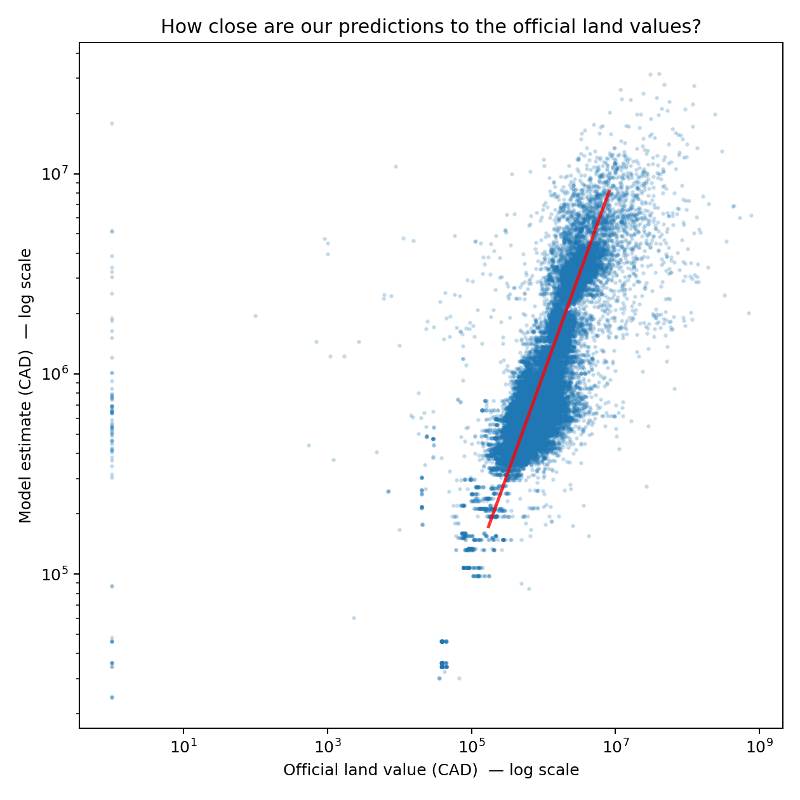
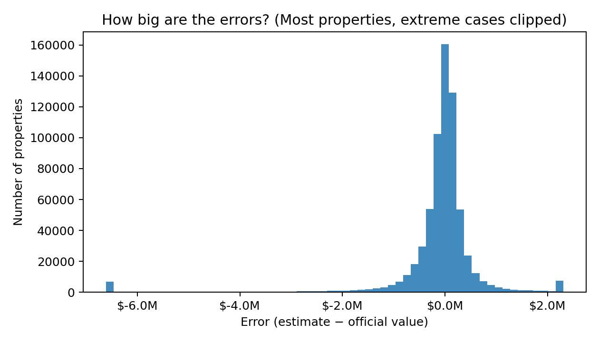
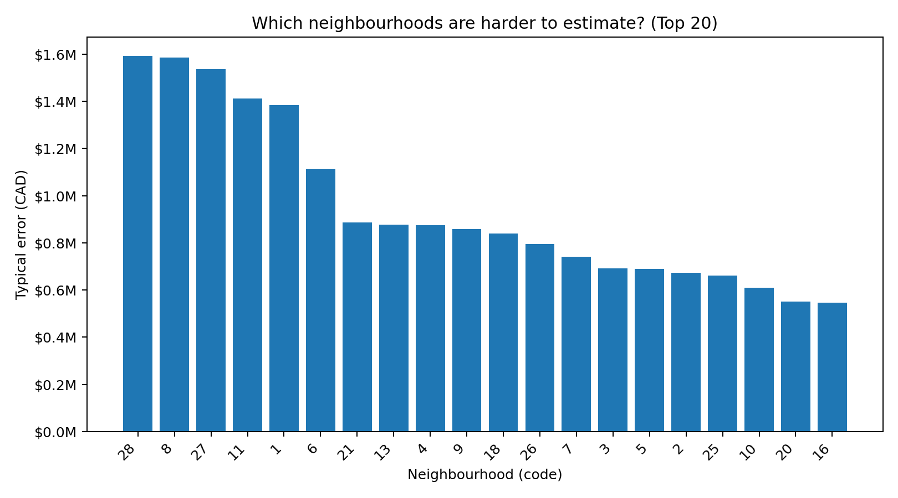
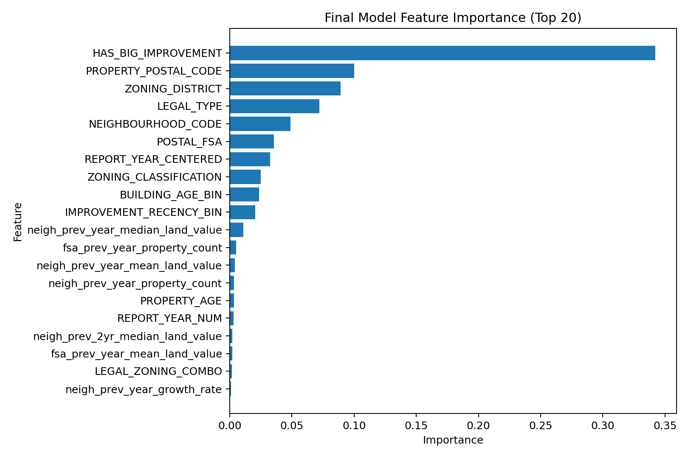

# CMPT 733 Final Project — WEB CRaWLer

## Project Overview
This project predicts Vancouver land **assessment** value (`CURRENT_LAND_VALUE`) and reports where prediction error is larger or smaller across neighbourhoods.

This repository uses one consolidated final pipeline:
- clean property data
- standardize external sources
- build one merged model table
- train and evaluate one final model

## At a Glance
- Target: `CURRENT_LAND_VALUE`
- Final merged table: `data/processed/model_table.parquet`
- Final trainer: `python -m src.models.train_model`
- Notebook demo: `final_submission_demo.ipynb`
- Web demo app: `app.py`
- Census status: deferred by default

## Notebook Demo Entry Point
This repository includes a root-level notebook: `final_submission_demo.ipynb`.

It is the easiest entry point for instructors or readers who prefer Jupyter Notebook. The notebook does not duplicate core project logic. Instead, it runs the existing Python modules in sequence and displays final outputs. It checks raw files, runs the pipeline steps, and shows final metrics, tables, and figures.

If you prefer a step-by-step notebook workflow, open `final_submission_demo.ipynb` and run the cells from top to bottom.

## Interactive Demo (Web App)
The project includes a lightweight web demo built with Streamlit:
- `app.py`

The demo allows users to enter a small set of property attributes and receive:
- a point estimate
- an estimated land value range

The demo uses the same trained model as the final pipeline (no separate model logic).

### What the demo does
- takes user-friendly inputs (postal code, zoning, neighbourhood, year built, optional improvement year, report year)
- internally reconstructs the full model feature vector using:
  - derived fields (for example `POSTAL_FSA`, property age, improvement flags)
  - lookup values from the merged model table (`data/processed/model_table.parquet`)
- runs the trained model and returns prediction plus an estimated uncertainty range

### Important note
- The demo predicts **land assessment value (`CURRENT_LAND_VALUE`)**
- It is **not** a guaranteed market sale price

### Run the web demo
```bash
python -m src.models.train_model
python -m streamlit run app.py
```

## Google Drive Raw Data Link
Raw data is shared outside git and should be downloaded from:  
https://drive.google.com/file/d/1ENhMgJCcVpjG5r3AhCcJd4pXKMpqBuBP/view?usp=sharing

## Target and Evaluation Protocol
- Prediction target: `CURRENT_LAND_VALUE`
- Train split: `REPORT_YEAR < 2024`
- Test split: `REPORT_YEAR >= 2024`
- Metrics:
  - RMSE
  - MAE
  - Median APE
  - robust RMSE/MAE (capped using training p99.5)

## Which Data Are Used in the Final Pipeline?
### Directly used
- Property tax:
  - Raw: `data/raw/property-tax-report.csv`
  - Cleaned fact table: `data/interim/property_tax_clean.parquet`
- Mortgage yearly features:
  - Raw: `data/raw/statcan_mortgage_rate_5yr_20260228.csv`
  - Standardized: `data/interim/mortgage_rate_yearly.parquet`
- IRCC permanent resident yearly features:
  - Raw: `data/raw/ircc_pr_cma_20260228.xlsx`
  - Standardized: `data/interim/ircc_pr_yearly.parquet`
- IRCC study permit yearly features:
  - Raw: `data/raw/ircc_studypermits_pt_studylevel_20260228.xlsx`
  - Standardized: `data/interim/ircc_study_permits_yearly.parquet`
- CMHC rental yearly features:
  - Raw: `data/raw/cmhc_vancouver_rental_supply_change_20260228.csv`
  - Standardized: `data/interim/cmhc_rental_yearly.parquet`

### Prepared but deferred by default
- Census profile:
  - Raw:
    - `data/raw/statcan_censusprofile2021_data_20260228.csv`
    - `data/raw/statcan_censusprofile2021_geoindex_20260228.csv`
    - `data/raw/statcan_censusprofile2021_meta_20260228.txt`
    - `data/raw/optional/statcan_censusprofile2021_single_geo_20260228.csv`
  - Standardized:
    - `data/interim/census_profile_standardized.parquet`
- Census merge is attempted only when `--merge_census` is passed and a robust shared geography key exists.
- In current data, census remains deferred because no robust shared key is available.

## Final Data Pipeline Outputs
- Final merged table:
  - `data/processed/model_table.parquet`
- Final table summary:
  - `reports/figures/model_table_summary.csv`

The final merged table includes:
- property-level derived features
- lag/yoy macro features
- leakage-safe neighbourhood/FSA historical features (previous-year and rolling past windows only)

## What the Feature-Importance Figure Means
The feature-importance chart (`reports/figures/model_feature_importance_top20.png`) shows which inputs the model relied on most for prediction.

- Larger bar = feature contributed more to predictive performance.
- Smaller bar = feature contributed less in this setup.
- Importance is relative.
- Importance is not causation.

Plain-language takeaway:
- property location/structure features dominate
- local historical context helps
- broad yearly macro signals contribute less

## Plain-Language Description of Key Features
| Feature | Plain-language meaning | Why it may matter | Source dataset |
|---|---|---|---|
| `LEGAL_TYPE` | Legal form of the property. | Different legal forms align with different value patterns. | `property-tax-report.csv` |
| `PROPERTY_POSTAL_CODE` | Full postal code. | Captures very local location differences. | `property-tax-report.csv` |
| `ZONING_DISTRICT` | City zoning district. | Zoning rules influence land use/value potential. | `property-tax-report.csv` |
| `ZONING_CLASSIFICATION` | Detailed zoning category. | Adds finer land-use context. | `property-tax-report.csv` |
| `NEIGHBOURHOOD_CODE` | City neighbourhood code. | Neighbourhoods have distinct market levels. | `property-tax-report.csv` |
| `YEAR_BUILT` | Year built. | Property age profile often correlates with value patterns. | `property-tax-report.csv` |
| `POSTAL_FSA` | First 3 postal characters (Forward Sortation Area). | Coarse local area grouping. | Derived from columns in `property-tax-report.csv` |
| `neigh_prev_year_median_land_value` | Previous-year neighbourhood median value. | Local historical market level. | Calculated from earlier years of the property-tax dataset (previous year only) |
| `neigh_prev_3yr_rolling_mean_land_value` | Rolling average over prior years in same neighbourhood. | Smoother local trend signal. | Calculated from earlier years of the property-tax dataset |
| `fsa_prev_year_median_land_value` | Previous-year median value in same FSA. | Postal-area historical context. | Calculated from earlier years of the property-tax dataset (previous year only) |
| `cmhc_rental_supply_existing_converted_lag1` | Previous-year CMHC converted rental supply indicator. | Lagged rental-market context. | `cmhc_vancouver_rental_supply_change_20260228.csv` |

## Final Model Outputs
### Core outputs
- `reports/figures/model_metrics.csv`
- `reports/figures/model_neighbourhood_error.csv`
- `reports/figures/model_feature_importance.csv`
- `reports/figures/model_feature_importance_grouped.csv`

### Public-friendly figures





## Demo Web App
The project includes a local Streamlit demo at `app.py`.

- It estimates **assessed land value** from a small set of user inputs.
- It uses the trained final model artifact (`artifacts/land_value_model.joblib`).
- It is for presentation and educational demo use, not professional appraisal.

App notes:
- The app predicts assessed land value, not guaranteed market sale price.
- Some internal model features are filled using derived fields and lookup values from `data/processed/model_table.parquet`.
- The app returns a point estimate and an estimated range.  
  The range uses neighbourhood-level typical error when available; otherwise it falls back to global model error.

## Current Finding
- Location/structure variables remain the main predictive drivers.
- Extra coarse macro information adds limited gain.
- Local historical features are useful, but the consolidated model still does not outperform the strongest property-only benchmark from earlier experiments.

## Setup
```bash
python -m venv .venv
source .venv/bin/activate  # Windows: .venv\Scripts\activate
pip install -r requirements.txt
```

## Run Final Pipeline
### Option A — Notebook demo entry point
Open `final_submission_demo.ipynb` and run cells from top to bottom.  
The notebook calls the same Python modules below and displays final metrics/figures.

### Option B — Python pipeline directly
```bash
python -m src.data.clean_property_tax --in_path data/raw/property-tax-report.csv --out_path data/interim/property_tax_clean.parquet

python -m src.data.standardize_mortgage_rate
python -m src.data.standardize_ircc_pr
python -m src.data.standardize_ircc_study_permits
python -m src.data.standardize_cmhc_rental
python -m src.data.standardize_census_profile

python -m src.data.build_model_table
python -m src.models.train_model
```

Optional census merge attempt:
```bash
python -m src.data.build_model_table --merge_census
```

### Run the Streamlit demo app
```bash
python -m src.models.train_model
python -m streamlit run app.py
```

If the artifact is missing, the app will show a message asking you to run training first.

## Data Governance
- Raw/interim/processed data files are not committed to git.
- Do not commit local data artifacts under `data/`.

## Project Evolution Note
Earlier experimental entry points were consolidated into this final submission pipeline to reduce maintenance overhead and avoid version confusion.

## License
MIT (see `LICENSE`).
