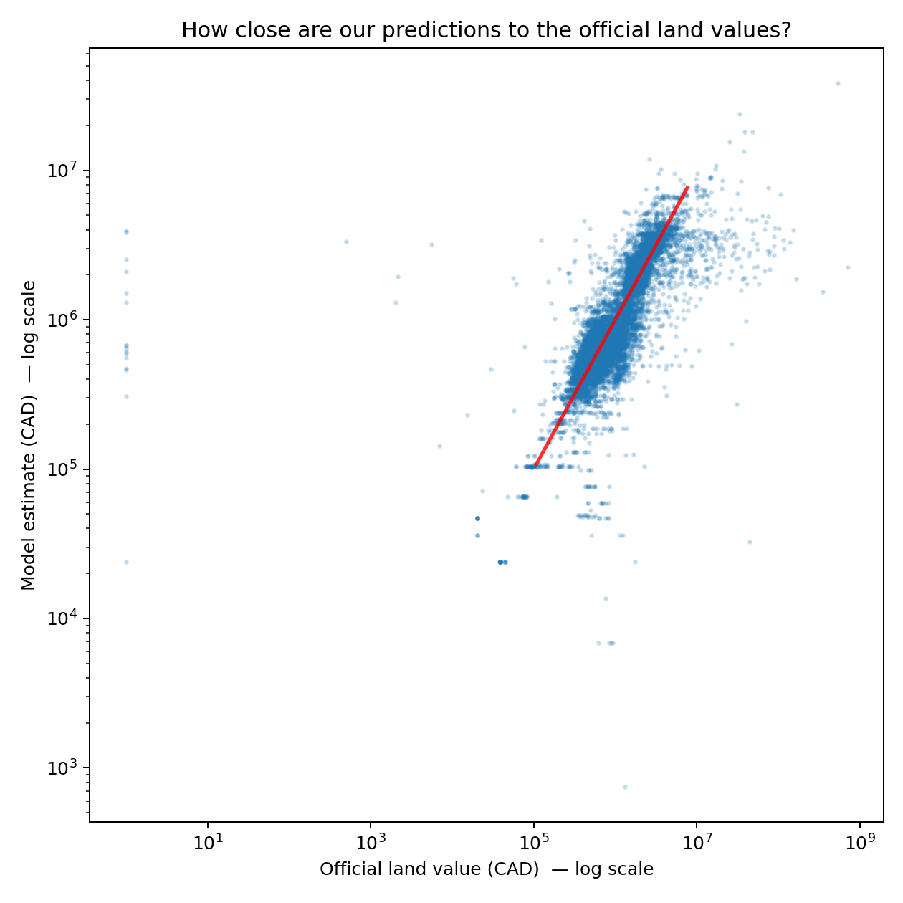
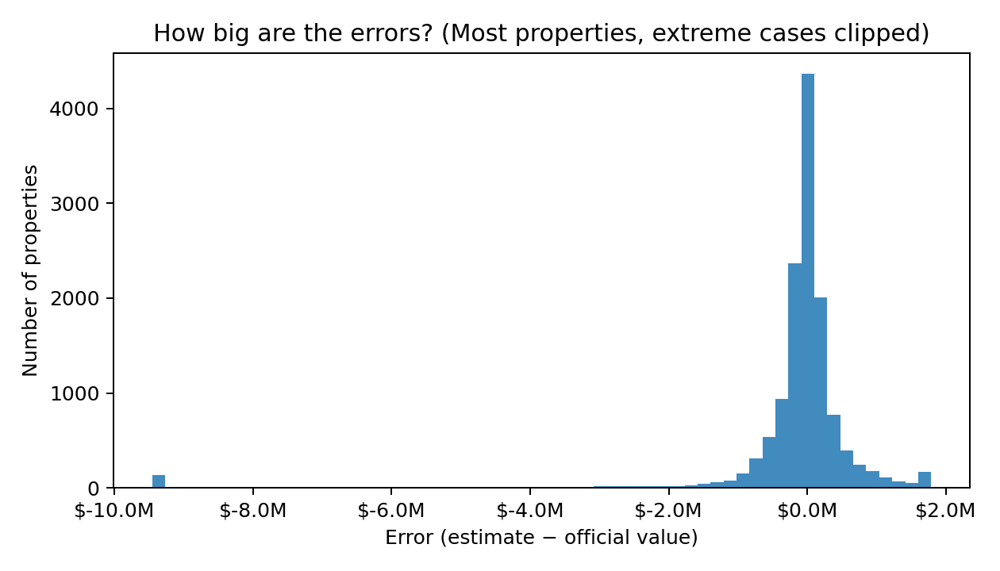
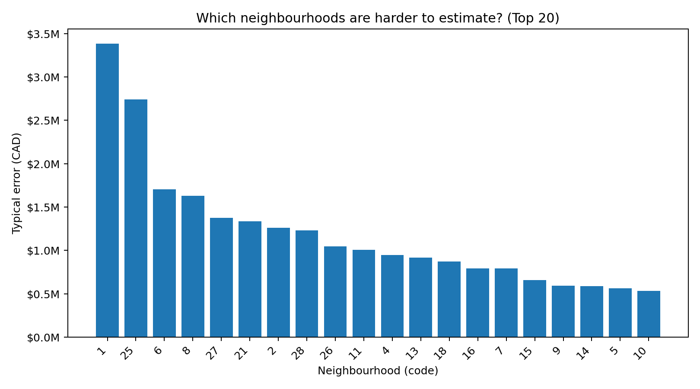

# CMPT 733 Final Project — WEB CRaWLer

## Project Overview
We predict **Vancouver property land assessment values** and study **model reliability across neighbourhoods** using multi-source public data.  
The project also includes a parallel track comparing a **Human Analyst** workflow vs. an **AI Agent** workflow under the same evaluation protocol.

## Team & Roles
- Chenzheng Li — data cleaning/integration + human-track modeling & evaluation
- Luna Sang — AI-agent track (design + implementation + demo)
- Ryan Chen — comparison analysis + presentation/report integration
- Wenxiang He — feature/analysis support + visualization & interpretation

---

## Dataset Sources (Raw Inputs)
> **Raw datasets are NOT committed to git.**  
> Team members should download the shared raw archive from Google Drive and place the extracted files under `data/raw/`.
>
> **Shared raw archive (Google Drive):**  
> https://drive.google.com/file/d/1E_TRIkR4O6fVaFZgEzJWl4mH9dc7Auo2/view?usp=sharing
>
> **Current status:** the project currently **trains only on the Property Tax dataset**. Other sources (Census/IRCC/CMHC/Mortgage rate) are downloaded and ready for later integration.
### 1) City of Vancouver — Property Tax Report (main training data)
- **File (raw):** `data/raw/property-tax-report.csv`
- **Source:** City of Vancouver Open Data Portal (Property Tax Report)
- **Format:** CSV, **semicolon-separated (`;`)**
- **Key columns used:**
  - `CURRENT_LAND_VALUE` (target)
  - `REPORT_YEAR` (time split)
  - `NEIGHBOURHOOD_CODE` (group-level reliability analysis)
  - plus zoning/ownership/age/location proxies (see Feature List below)

### 2) Statistics Canada — Census Profile 2021 (downloaded, not yet merged)
- Files (raw):
  - `data/raw/statcan_censusprofile2021_data_20260228.csv`
  - `data/raw/statcan_censusprofile2021_geoindex_20260228.csv`
  - `data/raw/statcan_censusprofile2021_meta_20260228.txt`
  - optional: `data/raw/optional/statcan_censusprofile2021_single_geo_20260228.csv`

### 3) IRCC — Permanent Residents / Study Permit Holders (downloaded, not yet merged)
- Files (raw):
  - `data/raw/ircc_pr_cma_20260228.xlsx`
  - `data/raw/ircc_studypermits_pt_studylevel_20260228.xlsx`

### 4) StatCan — Mortgage Rate (downloaded, not yet merged)
- File (raw): `data/raw/statcan_mortgage_rate_5yr_20260228.csv`

### 5) CMHC — Vancouver Rental Indicators (downloaded, not yet merged)
- File (raw): `data/raw/cmhc_vancouver_rental_supply_change_20260228.csv`

---

## Current Data Pipeline (What is used now)

### (1) What raw data is used before cleaning?
- **Raw training source:** `data/raw/property-tax-report.csv`
- **Used by cleaning script:** `src/data/clean_property_tax.py`

### (2) What cleaned data is used for modeling?
- **Cleaned dataset (parquet):** `data/interim/property_tax_clean.parquet`
- **Produced by:** `src/data/clean_property_tax.py`
- **Used by models:** `src/models/baseline.py`, `src/models/human_suite.py`

---

## Modeling Protocol

### (3) Train/Test split
We use a **time-aware split** based on `REPORT_YEAR`:
- **Train:** `REPORT_YEAR < 2024`
- **Test:** `REPORT_YEAR >= 2024`

This avoids temporal leakage and matches the course feedback requirement for an explicit training/testing split.

### (4) Features used for training (column name + meaning + type)
The current baseline model trains on the cleaned parquet using the following input features:

**Categorical (one-hot encoded)**
- `LEGAL_TYPE` — ownership/legal structure *(categorical)*
- `ZONING_DISTRICT` — zoning district code *(categorical)*
- `ZONING_CLASSIFICATION` — zoning/land-use category *(categorical)*
- `NEIGHBOURHOOD_CODE` — neighbourhood identifier *(categorical)*
- `PROPERTY_POSTAL_CODE` — location proxy *(categorical)*

**Numeric (median imputed + scaled)**
- `LAND_COORDINATE` — location proxy coordinate *(numeric; coerced to numeric in cleaning)*
- `YEAR_BUILT` — building year *(numeric)*
- `BIG_IMPROVEMENT_YEAR` — major improvement year *(numeric)*

> Notes:
> - Missing values are handled by `SimpleImputer` (most frequent for categorical, median for numeric).
> - Numeric features are scaled using `MaxAbsScaler` to stabilize Ridge regression.

### (5) Prediction target (column name + meaning + type)
- `CURRENT_LAND_VALUE` — assessed **land value** in CAD *(numeric)*

This is the variable the model predicts.

---

## Results / Outputs

All outputs are written to `reports/figures/`.

### Public-friendly figures (recommended for slides)
These figures are designed for non-technical audiences (e.g., policy stakeholders).

- `reports/figures/baseline_scatter_public.png` — model estimate vs official land value (CAD, log scale) with “perfect match” line  
- `reports/figures/baseline_error_distribution_public.png` — distribution of estimation errors (CAD; extreme cases clipped)  
- `reports/figures/baseline_neighbourhood_difficulty_public.png` — top-20 neighbourhoods by typical error (CAD)

#### How close are our predictions?


#### How big are the errors?


#### Which neighbourhoods are harder to estimate?


---

### Technical figures (for modeling/debugging)
- `reports/figures/baseline_scatter_log.png` — predicted vs actual (log1p) with y=x reference line  
- `reports/figures/baseline_residuals_clip.png` — residual histogram (clipped for readability)  
- `reports/figures/baseline_neighbourhood_mae_top20.png` — top-20 neighbourhoods by MAE  
- `reports/figures/baseline_neighbourhood_error.csv` — neighbourhood-level error summary table  


---

## Setup
Using `pip`:

```bash
python -m venv .venv
source .venv/bin/activate  # Windows: .venv\Scripts\activate
pip install -r requirements.txt
```
---
## How to Run (Current Human Track)
### 1) Clean raw CSV → parquet
input:
- `data/raw/property-tax-report.csv` (semicolon-separated)
run:
```bash
python -m src.data.clean_property_tax \
  --in_path data/raw/property-tax-report.csv \
  --out_path data/interim/property_tax_clean.parquet

```
output:
- `data/interim/property_tax_clean.parquet`
- `data/interim/property_tax_clean.parquet`

### 2) Run baseline model
```bash
python -m src.models.baseline
# optional sampling:
python -m src.models.baseline --sample_frac 0.1
```
output(example):
- `reports/figures/baseline_scatter_log.png`
- `reports/figures/baseline_neighbourhood_error.csv`
- `reports/figures/baseline_neighbourhood_mae_top20.png`

### Run human-track suite (optional)
```bahs
python -m src.models.human_suite
```
---
## License
MIT(see `LICENSE`)